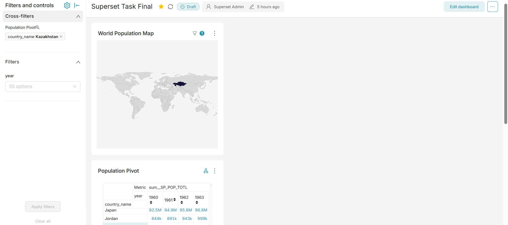
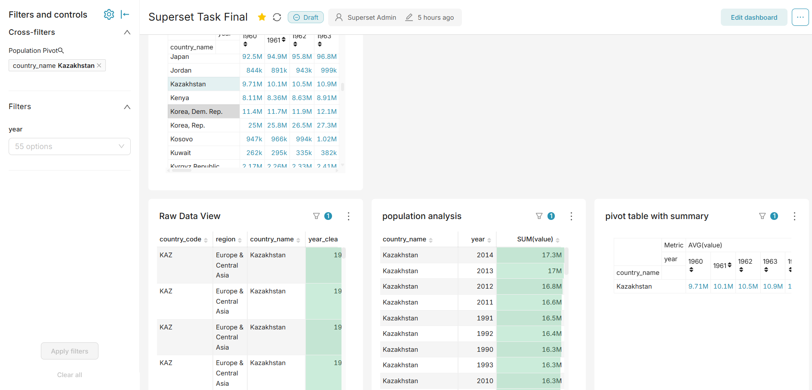

🚀 Superset Dashboard with Docker

📌 Overview

This project demonstrates an end-to-end Apache Superset setup using Docker.
It includes interactive dashboards, pivot tables, map visualizations, and global filters.

🛠️ Tech Stack
	•	Apache Superset
	•	Docker & Docker Compose
	•	PostgreSQL
	•	Redis

  ▶️ Run the Project
  docker-compose up -d
  Then open:

http://localhost:8088

Login:
	•	Username: admin
	•	Password: admin

  📊 Features Implemented

1. Pivot Table with Summary Row
	•	Custom summary row using average calculation
	•	Ignores null values

2. Map Visualization
	•	World population dataset

3. Global Dashboard Filter
	•	Multi-select filter
	•	Works across charts

  📸 Dashboard Preview
  
  
